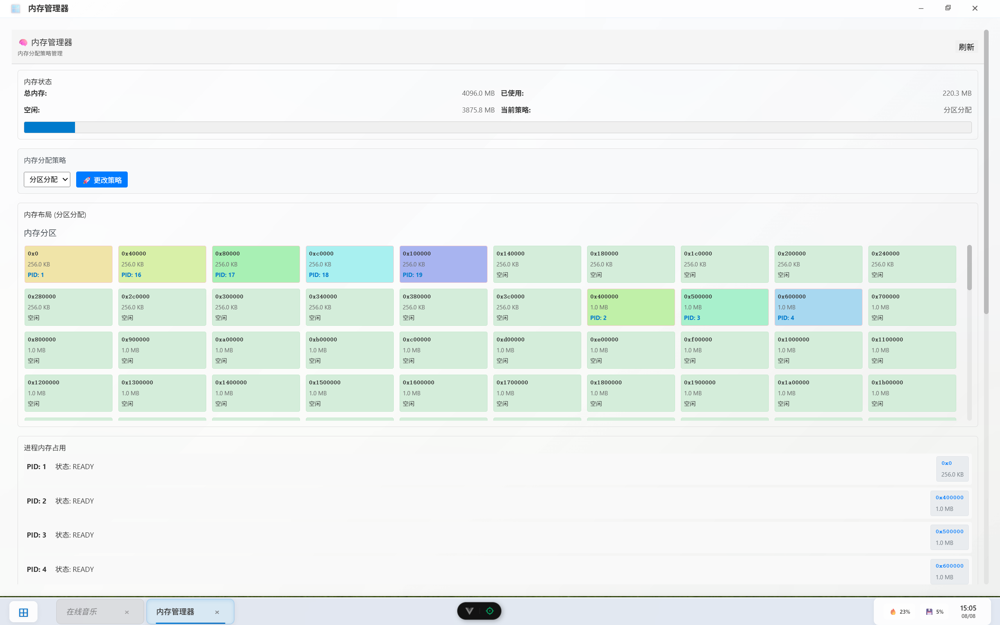

# 操作系统模拟器 (OS Simulator)


## 📖 项目简介

### 🎓 课程信息

本项目是 **BUPT 2024-2025 春季学期 操作系统课程设计大作业**，严格参照数据科学与大数据技术专业的课程设计要求完成。

⚠️ **重要提醒**：大数据专业的课程设计要求与其他专业的课程设计要求有所不同，请您对照根目录 `《操作系统课程设计》实验指导书.docx` 与您的课程实际要求。

### 💻 项目概述

本项目设计并实现了一个具有操作系统基本功能的软件（操作系统模拟程序）。该模拟器通过 C++ 后端实现核心 OS 功能，由 Vue.js 前端提供类似 Windows 桌面的图形用户界面，完整展现了现代操作系统的各项核心功能。

### 🔧 核心功能实现

该操作系统模拟器具有以下操作系统的基本功能：

#### 1. 进程管理和调度
- **进程创建** (new)：支持动态创建新进程，包含进程控制块(PCB)管理
- **进程调度** (scheduling)：实现FCFS、SJF、优先级调度、时间片轮转等多种调度算法
- **进程阻塞** (block)：模拟进程因等待I/O或资源而进入阻塞状态
- **进程唤醒** (wakeup)：处理阻塞进程的唤醒机制
- **进程同步** (synchronous)：实现进程间同步与互斥机制
- **内存不足处理**：创建进程时内存不足的处理机制，包括进程交换和内存回收

#### 2. 内存管理
- **存储分配与回收**：支持连续分配、分区分配、分页分配等多种内存管理策略
- **进程交换**：实现进程在内存与外存间的换入换出机制
- **内存可视化**：动态展示内存分配情况、内存块及其位置

#### 3. 时钟管理
- **Timer 功能**：系统时钟管理和定时器功能
- **时间片管理**：为时间片轮转调度提供时钟支持

#### 4. 中断处理
- **中断向量表**：完整的中断向量表管理
- **中断处理程序**：各类中断的处理程序实现
- **中断机制模拟**：真实模拟中断的触发、响应和处理过程

#### 5. 文件系统
- **目录/文件的创建和删除**：完整的文件系统操作支持
- **空间分配和回收**：文件存储空间的动态分配与回收
- **基于 inode 的文件系统**：实现现代文件系统的 inode 结构

#### 6. 设备管理
- **设备申请、分配、使用、释放**：完整的设备生命周期管理
- **设备队列管理**：设备请求队列的调度和管理
- **I/O 操作模拟**：模拟各种设备的输入输出操作

#### 7. UI界面
- **模拟终端**：提供命令行界面，支持各种系统命令
- **模拟GUI**：类 Windows 桌面环境，包含开始菜单、任务栏、窗口管理
- **手动控制程序执行**：用户可手动控制程序的提交和执行
- **图形界面展示多道程序并发执行**：实时可视化多个程序的并发执行过程
- **动态系统快照展示**：
  - 各并发进程的状态实时显示
  - 内存分配情况可视化（显示各进程占用的内存块及其位置）
  - 系统空闲内存块及其位置的动态展示
  - 各设备的状态及设备队列情况实时监控

#### 8. 中断机制模拟
- **完整中断机制**：从中断触发到中断处理的完整流程模拟
- **中断优先级管理**：支持不同优先级的中断处理
- **中断历史记录**：提供中断处理的历史记录和统计信息

### ✨ 核心特色

- **🔗 前后端分离**: C++ 后端专注于模拟操作系统核心逻辑，Vue.js 前端提供美观、交互式的用户界面
- **🧩 模块化设计**: 后端逻辑高度模块化，涵盖进程、内存、文件、设备、时钟、中断和调度等核心功能
- **🖥️ 图形化界面**: 提供类似 Windows 的桌面环境，包括开始菜单、任务栏、窗口管理和实时系统监控
- **🎯 功能丰富**: 内置文件管理器、进程管理器、设备管理器、终端等多种应用程序
- **🌐 RESTful API**: 通过清晰的 RESTful API 连接前后端，便于扩展和测试
- **⚡ 实时监控**: 动态展示系统运行期间的快照，包括进程状态、内存分配情况、设备状态等

---

## 🏗️ 项目架构

```
.
├── backend/                    # C++ 后端 (操作系统核心逻辑)
│   ├── include/                # 头文件目录
│   │   ├── common.h           # 通用定义和结构
│   │   ├── process/           # 进程管理头文件
│   │   ├── memory/            # 内存管理头文件
│   │   ├── fs/                # 文件系统头文件
│   │   ├── device/            # 设备管理头文件
│   │   ├── interrupt/         # 中断处理头文件
│   │   └── clock/             # 时钟管理头文件
│   ├── src/                   # 源代码目录
│   │   ├── core/              # 核心模块 (main.cpp, api_server.cpp)
│   │   ├── process/           # 进程管理实现
│   │   ├── memory/            # 内存管理实现
│   │   ├── fs/                # 文件系统实现
│   │   ├── device/            # 设备管理实现
│   │   ├── interrupt/         # 中断处理实现
│   │   └── clock/             # 时钟管理实现
│   ├── tests/                 # 测试文件
│   ├── doc/                   # 文档目录 (API.md)
│   ├── build/                 # 构建输出目录
│   └── CMakeLists.txt         # CMake 构建配置
└── frontend/                  # Vue.js 前端 (图形用户界面)
    ├── src/
    │   ├── components/
    │   │   ├── apps/          # 应用程序组件
    │   │   │   ├── ProcessManager.vue    # 进程管理器
    │   │   │   ├── MemoryManager.vue     # 内存管理器
    │   │   │   ├── DeviceManager.vue     # 设备管理器
    │   │   │   ├── FileManager.vue       # 文件管理器
    │   │   │   ├── Terminal.vue          # 命令行终端
    │   │   │   ├── MusicPlayer.vue       # 音乐播放器
    │   │   │   └── SystemControl.vue     # 系统控制面板
    │   │   ├── TheDesktop.vue             # 桌面组件
    │   │   ├── TheTaskbar.vue             # 任务栏组件
    │   │   ├── AppWindow.vue              # 应用窗口组件
    │   │   └── BootLoader.vue             # 启动加载器
    │   ├── services/
    │   │   └── api.ts         # API 客户端定义
    │   ├── stores/            # Pinia 状态管理
    │   ├── router/            # Vue Router 路由配置
    │   └── utils/             # 工具函数
    ├── public/                # 静态资源
    ├── package.json           # npm 依赖配置
    └── vite.config.ts         # Vite 构建配置
```

---

## 🚀 环境配置与运行指南

### 系统要求

- **操作系统**: Windows 11
- **命令行**: PowerShell
- **内存设定**: 模拟器设定内存为 4GB

### 前置依赖

#### 后端依赖
- **Visual Studio 2022** (包含 C++ 17 支持)
- **CMake 3.10+**
- **Git for Windows**

#### 前端依赖
- **Node.js 16.0+**
- **npm 或 yarn**

### 📦 安装步骤

#### 1. 克隆项目
```powershell
git clone <your-repository-url>
cd OS
```

#### 2. 后端构建

打开 PowerShell，进入后端目录：

```powershell
# 进入后端目录
cd backend

# 创建构建目录
if (!(Test-Path "build")) { mkdir build }
cd build

# 使用 CMake 生成项目文件
cmake .. 

# 编译项目
cmake --build . 
# 或者使用 Release 模式
# cmake --build . --config Release
```

#### 3. 前端构建

打开新的 PowerShell 窗口，进入前端目录：

```powershell
# 进入前端目录
cd frontend

# 安装依赖
npm install

# 启动开发服务器
npm run dev
```

### 🚀 运行项目

#### 启动后端服务器

在后端构建完成后：

```powershell
# 在 backend/build 目录下
cd Debug  # 或 Release

# 运行后端服务器
.\os_simulator.exe
```

后端服务器将在 `http://localhost:8080` 启动。

#### 启动前端界面

在前端目录下：

```powershell
# 确保在 frontend 目录
npm run dev
```

前端开发服务器通常在 `http://localhost:5173` 启动。

---

## 🧩 核心功能模块

### 后端核心模块

| 模块 | 文件路径 | 主要功能 |
|------|----------|----------|
| **进程管理** | `src/process/` | 进程创建、调度、状态管理、进程间通信 |
| **内存管理** | `src/memory/` | 内存分配与回收、连续内存管理、进程交换 |
| **文件系统** | `src/fs/` | 基于 inode 的文件系统、目录管理、文件操作 |
| **设备管理** | `src/device/` | 设备申请、分配、使用、释放，设备队列管理 |
| **中断处理** | `src/interrupt/` | 中断向量表、中断处理程序、中断机制模拟 |
| **时钟管理** | `src/clock/` | 系统时钟、定时器功能 |
| **调度器** | `src/process/scheduler.cpp` | FCFS、SJF、优先级、时间片轮转等算法 |

### 前端应用程序

| 应用 | 组件文件 | 功能描述 |
|------|----------|----------|
| **进程管理器** | `ProcessManager.vue` | 查看进程列表、调度算法切换、进程操作 |
| **内存管理器** | `MemoryManager.vue` | 内存分配情况、内存块可视化 |
| **设备管理器** | `DeviceManager.vue` | 设备状态查看、I/O 操作控制 |
| **文件管理器** | `FileManager.vue` | 文件浏览、文件操作、目录管理 |
| **终端** | `Terminal.vue` | 命令行界面、系统命令执行 |
| **系统控制** | `SystemControl.vue` | 系统配置、运行参数设置 |

---

## 💻 终端命令参考

模拟器内置了丰富的命令行接口，支持以下命令类别：

### 文件系统命令
```bash
ls                 # 列出当前目录内容
cd <path>          # 切换目录
pwd                # 显示当前目录路径
mkdir <name>       # 创建目录
touch <filename>   # 创建文件
rm <name>          # 删除文件或目录
cat <filename>     # 查看文件内容
```

### 进程管理命令
```bash
ps                 # 显示进程列表
kill <pid>         # 终止指定进程
run <name> <size>  # 创建新进程
jobs               # 显示作业列表
```

### 系统信息命令
```bash
free               # 显示内存使用情况
lsdev              # 显示设备列表
time               # 显示当前时间
uptime             # 显示系统运行时间
```

### 中断管理命令
```bash
register <vector> <type> <priority>  # 注册中断处理程序
trigger <vector> <data>              # 触发中断
inttable                             # 显示中断向量表
inthistory                           # 显示中断历史
```

### 其他命令
```bash
help               # 显示帮助信息
clear              # 清屏
exit               # 退出终端
```

---

## 🌐 API 接口文档

完整的 API 接口文档请参考：`backend/doc/API.md`

### 主要 API 端点

**基础 URL**: `http://localhost:8080/api/v1`

| 功能模块 | HTTP 方法 | 端点路径 | 描述 |
|----------|-----------|----------|------|
| 进程管理 | GET | `/processes` | 获取所有进程 |
| | POST | `/processes` | 创建新进程 |
| | DELETE | `/processes/{pid}` | 终止进程 |
| 内存管理 | GET | `/memory` | 获取内存状态 |
| | POST | `/memory/allocate` | 分配内存 |
| | DELETE | `/memory/free/{address}` | 释放内存 |
| 文件系统 | GET | `/filesystem/ls` | 列出目录 |
| | POST | `/filesystem/mkdir` | 创建目录 |
| | DELETE | `/filesystem/rm` | 删除文件 |
| 设备管理 | GET | `/devices` | 获取设备列表 |
| | POST | `/devices/{id}/request` | 请求设备 |
| | DELETE | `/devices/{id}/release` | 释放设备 |

---

## 🔄 系统初始状态

### 默认进程
系统启动时会创建以下默认进程：

| PID | 进程名 | 内存占用 | 状态 | 描述 |
|-----|--------|----------|------|------|
| 1 | idle_process | 100 KB | RUNNING | 空闲进程 |
| 2 | system_logger | 200 KB | RUNNING | 系统日志服务 |
| 3 | shell | 150 KB | RUNNING | 命令解释器 |

### 初始文件系统结构
```
/
├── home/
│   ├── welcome.txt                # 欢迎文件
│   └── myapp.pubt                # 用户应用程序
├── etc/
│   └── config.conf               # 系统配置文件
├── bin/
│   ├── calculator.pubt           # 计算器程序
│   ├── notepad.pubt             # 记事本程序
│   ├── browser.pubt             # 浏览器程序
│   └── game.pubt                # 游戏程序
├── var/
│   └── log/
│       └── system.log           # 系统日志
└── tmp/                         # 临时文件目录
```

---

## 🧪 测试

### 运行单元测试
```powershell
# 在 backend/build 目录下
.\Debug\unit_tests.exe
```

### 运行 API 集成测试
```powershell
# 确保后端服务器正在运行
.\Debug\api_tests.exe
```

### 使用 CTest
```powershell
# 在 backend/build 目录下
ctest -C Debug --verbose
```

---

## ⚠️ 注意事项

### 运行要求
1. **启动顺序**: 必须先启动后端服务器，再启动前端界面
2. **端口占用**: 确保 8080 和 5173 端口未被占用
3. **防火墙**: 可能需要允许应用程序通过 Windows 防火墙

### 常见问题排查

#### 后端编译失败
```powershell
# 检查 Visual Studio 和 CMake 版本
cmake --version
# 清理重新构建
Remove-Item -Recurse -Force build
mkdir build
cd build
cmake .. -G "Visual Studio 17 2022" -A x64
```

#### 前端启动失败
```powershell
# 清理 node_modules 重新安装
Remove-Item -Recurse -Force node_modules
Remove-Item package-lock.json
npm install
```

#### 前后端连接失败
1. 检查后端服务器是否正常运行
2. 检查防火墙设置
3. 验证 API 端点是否正确响应：
```powershell
# 使用 curl 测试 API
curl http://localhost:8080/api/v1/processes
```

### 性能优化建议
- 使用 Release 模式编译后端获得更好性能
- 关闭浏览器开发者工具以提升前端性能
- 监控系统资源使用情况

---

## 🖼️ 界面展示

### 主界面展示

#### 系统桌面环境
*类 Windows 桌面环境，提供直观的图形化操作界面*


#### 系统启动过程
*模拟真实操作系统的启动加载过程*


### 核心功能界面

#### 进程管理器
*提供完整的进程生命周期管理和多种调度算法演示*


**主要功能展示：**
- 进程列表实时显示（PID、状态、内存占用、CPU时间等）
- 进程创建对话框（支持设置进程名称、内存大小、CPU时间、优先级）
- 调度算法切换（FCFS、SJF、优先级调度、时间片轮转）
- 甘特图可视化显示进程调度过程
- 进程间关系管理（父子进程、同步/互斥关系）

#### 内存管理器
*多种内存分配策略的可视化展示*



**主要功能展示：**
- 内存分配策略切换（连续分配、分区分配、分页分配）
- 内存块可视化图表，不同颜色代表不同进程占用
- 实时内存使用统计（总内存、已用内存、空闲内存）
- 内存碎片和整理情况展示

#### 文件系统管理
*基于 inode 的完整文件系统实现*


**主要功能展示：**
- 目录树结构浏览
- 文件和文件夹的创建、删除、重命名操作
- 文件属性查看（大小、类型、创建时间等）
- 文件系统配置和状态监控

#### 设备管理器
*设备生命周期管理和I/O操作模拟*


**主要功能展示：**
- 设备状态实时监控（空闲、繁忙、错误状态）
- 设备请求队列可视化
- I/O 操作模拟和历史记录
- 设备类型统计和性能分析

#### 终端命令行
*功能丰富的命令行界面*


**主要功能展示：**
- 支持完整的文件系统操作命令（ls、cd、mkdir、rm等）
- 进程管理命令（ps、kill、run、jobs等）
- 系统信息查询命令（free、lsdev、time、uptime等）
- 中断管理命令（register、trigger、inttable等）

#### 系统控制面板
*系统参数配置和运行状态监控*


**主要功能展示：**
- 系统运行时间和状态监控
- 各模块参数配置
- 系统性能统计图表
- 日志查看和系统诊断

### 动态展示功能

#### 多道程序并发执行
*实时可视化多个程序的并发执行过程*


#### 系统运行快照
*动态展示系统运行期间的完整状态*


**快照内容包括：**
- 各并发进程的实时状态变化
- 内存分配情况的动态更新
- 各进程占用内存块位置的可视化
- 系统空闲内存块的实时展示
- 设备状态和队列情况的动态监控

---

## 📈 功能演示

### 进程管理与调度演示
1. **基础进程操作**
   - 打开进程管理器查看当前系统进程
   - 创建新进程并观察内存自动分配
   - 查看进程控制块(PCB)详细信息
   - 终止进程并观察资源自动释放

2. **调度算法对比**
   - 创建多个不同优先级和CPU时间的进程
   - 切换FCFS、SJF、优先级调度、时间片轮转算法
   - 通过甘特图观察不同算法的调度效果
   - 比较各算法的平均等待时间和周转时间

3. **进程同步与通信**
   - 创建父子进程并观察进程树结构
   - 设置进程间同步和互斥关系
   - 模拟生产者-消费者问题
   - 观察进程阻塞和唤醒机制

### 内存管理策略演示
1. **多种分配策略对比**
   - 在连续分配模式下创建和终止进程
   - 切换到分区分配观察内存碎片问题
   - 使用分页分配解决外部碎片
   - 对比不同策略的内存利用率

2. **内存不足处理**
   - 创建大量进程直至内存不足
   - 观察进程交换机制的自动触发
   - 查看换入换出的进程选择策略
   - 监控内存回收和整理过程

### 文件系统操作演示
1. **图形界面操作**
   - 使用文件管理器创建目录结构
   - 演示文件的创建、删除、重命名操作
   - 查看文件属性和inode信息
   - 观察文件系统空间分配情况

2. **命令行操作**
   - 通过终端执行各种文件操作命令
   - 演示相对路径和绝对路径的使用
   - 使用cat命令查看文件内容
   - 批量文件操作的高效执行

### 设备管理与I/O演示
1. **设备状态监控**
   - 查看系统中所有设备的类型和状态
   - 观察设备从空闲到繁忙的状态转换
   - 监控设备请求队列的动态变化
   - 查看设备使用历史和统计信息

2. **I/O操作模拟**
   - 模拟不同类型设备的I/O请求
   - 观察设备分配和释放的完整过程
   - 演示设备队列的调度策略
   - 模拟设备故障和错误处理

### 中断机制演示
1. **中断向量表管理**
   - 查看完整的中断向量表
   - 注册自定义中断处理程序
   - 设置中断优先级和类型
   - 观察中断向量的动态分配

2. **中断处理过程**
   - 手动触发各类中断事件
   - 观察中断的响应和处理过程
   - 查看中断处理的历史记录
   - 分析中断处理的性能统计

### 综合系统演示
1. **系统负载测试**
   - 同时运行多个应用程序
   - 观察系统资源的动态分配
   - 监控系统性能指标变化
   - 测试系统的稳定性和响应能力

2. **故障恢复演示**
   - 模拟各种系统异常情况
   - 观察系统的自动恢复机制
   - 演示错误处理和日志记录
   - 验证系统的健壮性和可靠性

---

## 🤝 贡献指南

欢迎提交 Issues 和 Pull Requests！

### 开发流程
1. Fork 本仓库
2. 创建特性分支：`git checkout -b feature/AmazingFeature`
3. 提交更改：`git commit -m 'Add some AmazingFeature'`
4. 推送到分支：`git push origin feature/AmazingFeature`
5. 提交 Pull Request

### 代码规范
- 后端遵循 C++17 标准
- 前端使用 TypeScript 和 Vue 3 Composition API
- 提交前请运行测试确保代码质量

---

## 📝 许可证

本项目仅用于教育目的，为操作系统课程设计作业。

---

## 📞 联系方式

如有问题或建议，请通过以下方式联系：

- 🐛 Bug 报告：提交 GitHub Issue
- 💡 功能建议：提交 GitHub Issue
- 📧 邮件联系：holour@bupt.edu.cn

---

**祝您使用愉快！🎉** 